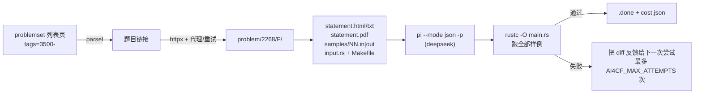

# ai4cf — 自动下载并求解 Codeforces 题目（pi + deepseek）

给一个难度阈值（例如 3500），Python 会遍历 problemset 列表页、解析出每道题的链接，
为每道题建立本地工作目录（题面、样例输入输出、Rust 输入模板、Makefile、提示词），
然后调用 **pi**（deepseek 模型）在非交互模式下求解，最后用官方样例**自动验证**，
并记录每次尝试的费用。所有代码都落在题目目录的 `main.rs` 里（单文件、仅标准库），
可以直接提交。

## 快速开始

```bash
uv sync                    # 安装 Python 依赖（uv add / uv run 管理）
make smoke                 # 下载并求解 1 道题（.env 中的 AI4CF_LIMIT=1）
make help                  # 查看所有目标
```

依赖：`uv`、`rustc`/`rustfmt`、已登录 deepseek 的 `pi`。

## 工作流



`make` 目标：

| 目标 | 作用 |
|---|---|
| `make all` | `download` + `solve` |
| `make download` | 遍历列表页，建立/补齐题目目录（已下载的跳过） |
| `make solve` | 对所有未完成的题目调用 pi（可断点续传） |
| `make smoke` | 只跑 1 道题（`LIMIT=1`） |
| `make verify` | 全局验证：重新编译并跑所有**已完成**题目的样例 |
| `make bench` | 对某一题计时 `scratch/*.in` 的**每个输入**并给出最坏值（`PROBLEM=2245/H`），时间或内存超限即判不合格 |
| `make verdict` | 用官方 API 拉取你最近一次提交的判定（test 号/耗时/内存），写进该题 `verdict.json` |
| `make fmt` | 用 rustfmt 格式化所有 `main.rs`（含 `static/input.rs`） |
| `make lint` | ruff 检查/格式化本 Python 包 |
| `make cost` | 费用报表：每题花费、token 数、总花费 |
| `make status` | 每题状态：done / failed / pending / attempted |
| `make clean` / `make distclean` | 删除 Rust 产物 / 删除所有题目的工作目录 |

命令行参数可以就地覆盖 `.env`（导出的环境变量优先级高于 `.env`）：

```bash
make all LIMIT=0 JOBS=4              # 跑全部，4 并发
uv run ai4cf solve -p 2268/F         # 只解这一题
uv run ai4cf verify -p 2268/F -v     # 详细输出该题的每个样例
uv run ai4cf bench problem/2245/H    # 用 scratch/max.in 计时（对比时限/标杆）
uv run ai4cf download -P 2245/H      # 只刷新这一题的工作区
uv run ai4cf download --page-limit 1 # 只遍历第 1 页
```

## 常用链接（参数说明）

以 `2268/F` 为例：`{contest}` = `2268`，`{index}` = `F`。这些 URL 也写进了每题的
`meta.json`（`links`）和 `statement.txt`（Links 段）。

| 用途 | URL | 参数说明 |
|---|---|---|
| 题目列表（按难度/标签筛选） | `https://codeforces.com/problemset/page/{page}?tags={tags}` | `page` 从 1 开始；`tags=3500-` = rating ≥ 3500，`1600-1900` = 闭区间，`-1200` = 上限；多标签/难度用 `+` 组合，如 `3500-+dp`；对应 `.env` 的 `AI4CF_TAGS` |
| 题目页面 | `https://codeforces.com/problemset/problem/{contest}/{index}` | 题面；PDF 题会内嵌查看器，本仓库自动识别并额外下载 `statement.pdf`（文本抽进 `statement.txt`） |
| 提交 | `https://codeforces.com/problemset/submit/{contest}/{index}` | 需登录；提交 `problem/{contest}/{index}/main.rs` |
| 成绩 / 运行时间排名 | `https://codeforces.com/problemset/status/{contest}/problem/{index}/page/{page}?order=BY_CONSUMED_TIME_ASC` | `order` 可选 `BY_CONSUMED_TIME_ASC/DESC`、`BY_PROGRAM_LENGTH_ASC/DESC`、`BY_JUDGED_ASC/DESC`；`&verdictName=OK` 只看 AC（其他取值 `WRONG_ANSWER`、`RUNTIME_ERROR`、`REJECTED`）；`&programTypeForInvoker=cpp.gcc13-64-winlibs-g++20` 按语言过滤（其余取值如 `rust.2021`、`rust.2024`、`python.pypy3-64`、`java21`、`go`）；`page` 翻页 |
| 题目成绩（无参路径，脚本用） | `https://codeforces.com/problemset/status/{contest}/problem/{index}` | 同一张表，**不带 query** 才不会被 Cloudflare 拦截；`ai4cf` 用它统计最快/中位运行时间作参考 |
| 某场比赛的提交（API） | `https://codeforces.com/api/contest.status?contestId={contestId}&from=1&count={count}` | 官方 API，JSON，含 `verdict`/`timeConsumedMillis`/`memoryConsumedBytes`/`programmingLanguage` |

> 带 query（`?order=…`）的 status 页面只适合浏览器打开：给脚本抓取时 CF 会返回
> Cloudflare 挑战页（"Just a moment..."）。所以 `ai4cf` 抓参考数据时走无参数路径，
> 在本地筛选 AC 行并统计（只取聚合数字，不取任何人的代码）。

## 目录结构

```
.env                       所有参数（阈值、并发、超时、代理、pi 参数）
Makefile                   上面的目标
static/input.rs            快速输入模板（会被复制进每个题目目录，供 pi 参考/内联）
static/prompt.md           pi 的提示词模板（占位符由 Python 渲染）
static/Makefile            每个题目目录里的 Makefile 模板
src/ai4cf/config.py        .env -> Settings
src/ai4cf/fetch.py         限速+重试+代理的 HTTP 客户端
src/ai4cf/problemset.py    列表页 -> ProblemRef（含 rating/tags）
src/ai4cf/statement.py     题目页 -> 题面 + 样例（HTML 与 PDF 两种形态）
src/ai4cf/status.py        成绩页 -> 运行时间参考（最快/中位/内存/语言，仅聚合量）
src/ai4cf/bench.py         scratch/max.in 计时与内存（os.wait4 取子进程 rusage）
src/ai4cf/workspace.py     落盘：题面、样例、input.rs、Makefile、meta.json
src/ai4cf/solver.py        调用 pi、收集用量/费用、判定与标记
src/ai4cf/verify.py        rustc 编译 + 样例比对（唯一判定标准）
src/ai4cf/cost.py          费用聚合报表
problem/<contest>/<index>/ 每道题工作目录（`.gitignore` 已忽略 `problem/`）
```

单个题目目录：

```
statement.html        官方题面（原样片段 + 绝对化链接，可直接浏览器打开）
statement.txt         题面纯文本（含 limits/tags/样例数量）
statement.pdf         仅当该题题面是 PDF 时存在（同时把文本抽取进 statement.txt）
samples/01.in|out    官方样例，逐对编号
scratch/*.in         pi 生成的对抗性输入（`make bench` 逐个计时计内存，取最坏）
verdict.json         你上一次提交的判定（`make verdict` 拉取，重跑时进入提示词）
input.rs             快速输入模板（std only）
Makefile             make build / run / test / fmt / clean
meta.json            元数据：rating、tags、时限、内存、url、是否交互题
main.rs              **交付物**：单文件、仅标准库、stdin->stdout
prompt.md            本次尝试实际发给 pi 的提示词（含上一次失败反馈）
.pi/                 pi 会话与每次尝试的 stream/answer/err 日志
cost.json            每次尝试的时间、token、美元花费、判定、失败摘要
.done / .failed      完成/放弃标记（断点续传依据）
```

## 参数（.env）

| 变量 | 默认 | 含义 |
|---|---|---|
| `AI4CF_TAGS` | `3500-` | Codeforces `tags` 过滤串，`3500-` 表示 rating ≥ 3500，也支持 `1600-1900`、`3500-+dp` |
| `AI4CF_LIMIT` | `1` | 每次最多处理多少题；**0 表示不限**（遍历全部列表页 / 所有待做题目） |
| `AI4CF_JOBS` | `1` | 下载与求解的并发数；0 表示按 CPU 核数 |
| `AI4CF_MAX_ATTEMPTS` | `3` | 单题最多尝试次数，超过后写 `.failed` 并跳过 |
| `AI4CF_PROBLEM_DIR` | `problem` | 工作目录 |
| `AI4CF_PROXY` | 空 | 形如 `http://127.0.0.1:7890`；为空则直连 |
| `AI4CF_FETCH_DELAY` | `1.0` | 两次请求之间的最小间隔（CF 请求过快会返回 403） |
| `AI4CF_FETCH_RETRIES` | `4` | 网络/403/429/5xx 的重试次数（指数退避） |
| `AI4CF_FETCH_TIMEOUT` | `30` | 单次请求超时（秒） |
| `AI4CF_USER_AGENT` | 浏览器 UA | CF 对默认 UA 直接 403 |
| `AI4CF_TIME_MULT` | `3.0` | 样例运行的时限倍率：`时限 × 倍率`，用于暴露接近 TLE 的解法 |
| `AI4CF_BENCH_MULT` | `3.0` | `make bench` 单个形态的等待上限：`时限 × 倍率` 秒后杀进程（判定仍以真实时限为准） |
| `AI4CF_STATUS_REFERENCE` | `1` | 抓成绩页给 pi 当性能参考（最快/中位 AC 时间、内存、语言）；0 = 关闭 |
| `AI4CF_HANDLE` | 空 | 你的 CF 用户名；重跑某题前自动拉取你上次提交的判定作为反馈（也可用 `make verdict` 手动刷新） |
| `PI_BIN` | `pi` | pi 可执行文件 |
| `PI_MODEL` | `deepseek/deepseek-v4-pro` | pi 的 `--model` 参数 |
| `PI_THINKING` | `high` | pi 的 `--thinking` 等级 |
| `PI_TIMEOUT` | `3600` | 单次尝试的墙钟上限（秒），超时杀进程组并记为 `pi_timeout` |
| `PI_EXTRA_ARGS` | 空 | 追加给 pi 的参数（例如 `--approve`） |

## 验证方式（保证“跑完即可提交”）

1. `main.rs` 必须能被 `rustc --edition 2021 -O main.rs` 编译 —— 这一条同时证明了
   “单文件 + 仅标准库 + 不引用外部文件”。
2. 用官方样例逐对比较（忽略行尾空白与末尾空行）。判定逻辑只有一份，
   题目目录里的 `make test` 就是调用它（`ai4cf check`），因此 pi 看到的结论与
   `make verify` 完全一致。
3. 运行时限 = 题目时限 × `AI4CF_TIME_MULT`，超过即判 TLE，让“样例能过但会超时”的解法暴露出来。
4. 提示词里明确要求：先 `make test` 全过；对贪心/构造/计数/DP 类题目再写暴力 + 随机
   数据做对拍（放在 `./scratch/`，不得被 `main.rs` 引用）；并且要说明复杂度、注意常数。
5. 编排器在 pi 退出后**自己再验证一次**，通过才写 `.done`，所以“完成”标记只代表
   “当前磁盘上的 `main.rs` 真的通过了全部样例”。
6. 性能：`make bench`（`ai4cf bench`）对 `./scratch/*.in` 的**每个输入**计时并测峰值内存，
   报告占时限/内存上限的比例、给出最坏输入，并与成绩页的“最快 AC / 中位 AC”对照；
   **时间或内存任一超限**即判 `TOO SLOW` / `OVER MEMORY`（退出码 1）；测得输入少于 3 个会
   打 `WARN`（最坏情况没覆盖）。解出后编排器自己再跑一遍全部输入，结果写进 `.done.bench`
   （`ms`/`rss_kb`/`shapes`）；样例通过但最坏输入超时限会在 `make solve` 输出里打 `WARN`。

失败时：把样例 diff（或 rustc 报错）写入 `cost.json` 并出现在下一次尝试的提示词里
（`## Previous attempt feedback`），最多重试 `AI4CF_MAX_ATTEMPTS` 次。

没有官方样例的题目（少数 PDF 题面）无法验证：pi 自报 `STATUS: SOLVED` 时照常写 `.done`，
但 `"verified": false`，`make verify` 会跳过它们，`make cost` / `make status` 用 `*` 标出——
宁可显式标“未验证”，也不假装通过。

## 性能参考（提示词怎么给 pi 定目标）

`AI4CF_STATUS_REFERENCE=1` 时，下载阶段会顺手抓一次该题的成绩页，只统计**聚合量**：
最快 AC、page 1 上 50 条 AC 的中位数/最慢值、内存范围、语言分布，写进 `meta.json.status`，
并在提示词里渲染成一段 `## Performance reference`，例如 2245/H：

```
- fastest accepted: 843 ms (11% of the 8000 ms time limit)
- median of the 50 accepted submissions on page 1: 1867 ms (slowest of that sample: 6968 ms)
- accepted memory range: 94.3-752.0 MiB
- languages: C++23 (GCC 14-64, msys2) x28, C++20 (GCC 13-64) x15, C++17 (GCC 7-32) x5
```

median 1867 ms / 8000 ms 说明这题常数卡得很紧；pi 看到这个数就知道“超线性或常数差 3 倍就 TLE”。
提示词里同时要求：先写复杂度、再生成 `scratch/max.in`、用 `make bench` 实测、
目标 ≤ 1/3 时限、与最快 AC 同量级，并列出常见常数浪费（逐 token 分配、热循环里的
`format!`/`println!`、`Vec<Vec<_>>`、无谓 `clone`、稠密小键用 `HashMap`、循环内重排序等）。

> 只取数字，不取任何提交的代码：参考的是“这题有多快”，不是“别人怎么写”。

**为什么要按“形态”计时**：最大规模 ≠ 最坏情况。实测 2245/H 的同一份解法（时限 8000 ms）：

| 输入形态 | 规模 | 耗时 |
|---|---|---|
| 均匀随机 | 1×100×20000 | 151 ms (2%) |
| `t` 最大 | 10000×100×2 | 222 ms (3%) |
| 值/零条纹列 | 1×100×20000 | 3888 ms (49%) |
| **全零** | 1×100×20000 | **> 80000 ms**（被杀） |

同一份代码在不同结构下相差 500 倍以上 —— 它在 CF 上 TLE 就是这么来的。所以提示词要求：
先说出内层循环到底在数什么（枚举数对/哈希探测/访问格数…），再构造**让这个量最大**的输入，
也要按**内存**审：`pairbomb` 形态把“枚举数对”的解法推到 3.5 GiB（上限 1024 MiB），
这就是 2245/H 被 `MEMORY LIMIT EXCEEDED on test 20` 打回的原因。

## 提交后的反馈闭环

本地的 `make test` / `make bench` 只能证明“本地最好情况”；真正的判定在 CF。所以：

```bash
make verdict PROBLEM=2245/H     # 拉取你最近一次提交的判定
make solve PROBLEM=2245/H --force   # 重跑（提示词里会自动带上判定反馈）
```

`AI4CF_HANDLE` 设置后，重跑前也会自动刷新一次判定。反馈形如：

```
## The judge already rejected a submission of this problem

The last submission of `iydon` was **MEMORY LIMIT EXCEEDED** on test 20
(memory limit exceeded on test 20 after 7687 ms 1024 MiB; Rust 2024).

It peaked at 1024 MiB against the 1024 MiB limit: the approach holds far too much data at once.
That test will be there again, so the fix has to change how much work and memory the
solution uses on that kind of input — not shave a constant factor.
```

实测 2245/H 的那一轮：`test 20` 上先是 `TIME_LIMIT_EXCEEDED`（8000 ms / 901 MiB），
再是 `MEMORY_LIMIT_EXCEEDED`（1024 MiB）——本地用 `pairbomb_*.in` 复现出 3.5 GiB / >24 s，
与 CF 的判定一致，说明这类“按对数枚举”的解法必须换算法而不是调常数。

## 断点续传与中断

* 状态完全落在文件系统上：`.fetched`（已下载）、`.done`（已验证通过）、`.failed`（放弃）。
* 重复执行 `make download` / `make solve` 会跳过已完成项；中断后直接重跑即可继续。
* `Ctrl+C` / `SIGTERM`：先杀掉 pi 的整个进程组（SIGTERM，10s 后 SIGKILL），
  把这次尝试记为 `interrupted` 写入 `cost.json`，不破坏任何已完成标记。
* `uv run ai4cf solve --force` 重解已完成的题；`--retry-failed` 重试 `.failed` 的题。

## 费用

`cost.json` 的用量来自 `pi --mode json` 流里的 assistant `usage`（token 与美元），
缺失时回退到 pi 的 session 日志。`make cost` 汇总每题与全项目花费：

```
2268F      done      attempts=2  cost=$1.2345 tokens=  210.4k (...) rating=3500  Deglado
    attempt 1: samples_failed exit=0   612.3s $0.5712 model=deepseek/deepseek-v4-pro
      detail: --- 01 (expected)
    attempt 2: solved         exit=0   498.1s $0.6633 model=deepseek/deepseek-v4-pro

problems: done=1
spent on solved problems: $1.2345
spent in total:           $1.2345
```

`uv run ai4cf cost -p 2268/F` 可以只看某一题的细节。

## 备注

* 题面是 PDF 的题目（列表页没有 `div.problem-statement`，或内嵌 PDF 查看器）会被自动识别：
  下载 `statement.pdf`，用 pypdf 抽取文本写入 `statement.txt`；样例仍从页面上的
  `div.sample-test` 取（两组 `<pre>` 分别对应 `<br>` 与 `div.test-example-line` 两种排版）。
* 交互题（tag 含 `interactive`）会写进 `meta.json`，提示词会要求改用逐行读写 + flush，
  但样例验证对交互题意义有限，会被标记为无样例。
* pi 以 `--no-context-files --no-skills` 启动，避免读到本仓库的上下文文件；
  其余参数（含 `--approve`）可通过 `PI_EXTRA_ARGS` 追加。

## 已知限制

* 一次尝试是一整段 pi 会话，`PI_TIMEOUT` 是硬上限；3500+ 的难题建议保持默认 3600s
  （实测一个 800 分题也可能耗费 ~600s 才收尾）。
* `AI4CF_LIMIT=0` 会遍历全部列表页（`tags=3500-` 目前是 3 页 / 247 题），
  并对所有未完成题目启动 pi —— 费用会线性增长，请先用小 `LIMIT` 验证。
* 判定只认官方样例；样例弱是题目本身的属性，所以提示词要求对拍（`./scratch/`），
  但编排器无法验证“对拍做过没有”，只能验证样例与时限。
* 站点改版会破坏 parsel 选择器（`td.id a` / `span.ProblemRating` / `div.sample-test`）；
  解析失败会体现为“下载 0 题”或“无样例”，而不是静默出错。
* `make verify` 只校验当前磁盘上的 `main.rs`；`.done` 不记录文件哈希，
  手工改动后请重新 `make verify`。
